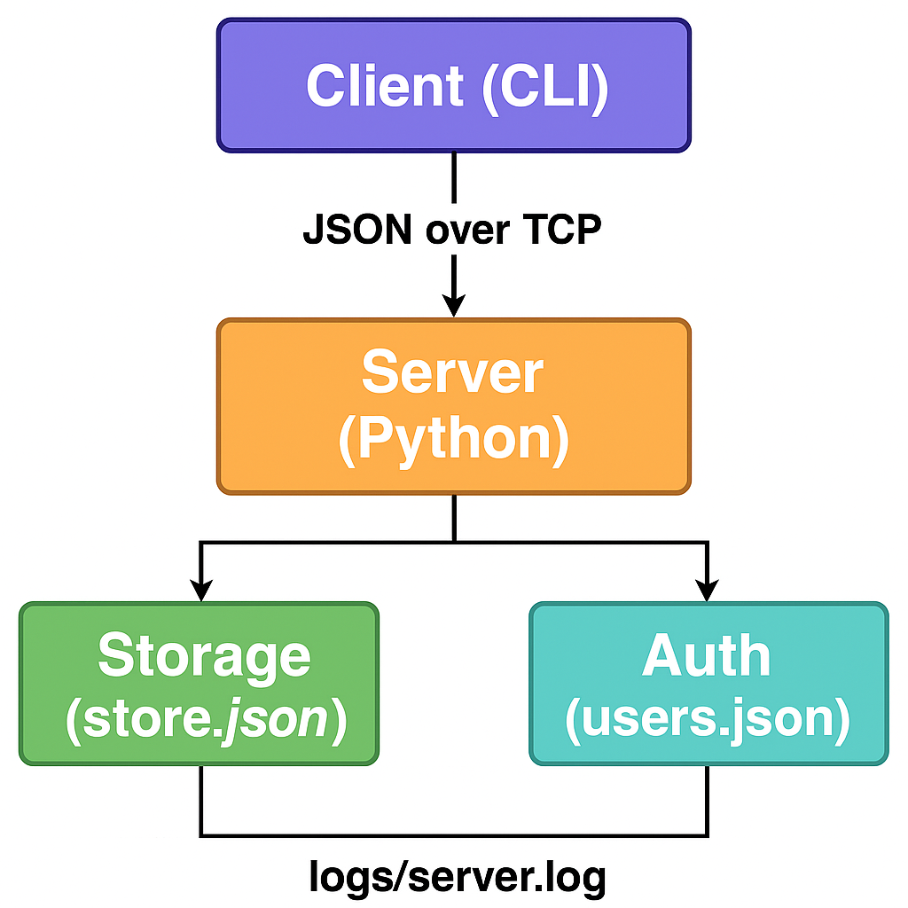

# Pysolutions

A simple **client–server Python application** built for CIS 4850.  
Implements authentication, data persistence, logging, command aliases, and a colorful CLI.

---

## Features
- 🔑 **User accounts**: register/login with password hashing
- 💾 **Persistent storage**: saves data in JSON files
- 🎨 **Colorful CLI** with command aliases (`ls` → list, `rm` → remove, etc.)
- 📝 **Help menu** with clear command list
- 📂 **Logging**: server writes events to `logs/server.log`
- 📊 **Architecture diagram** in `/docs/architecture.png`

---

## Architecture


---

## Installation
1. Clone the repo:
   ```bash
   git clone https://github.com/<your-username>/pysolutions.git
   cd pysolutions
